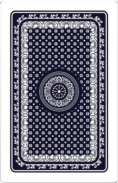
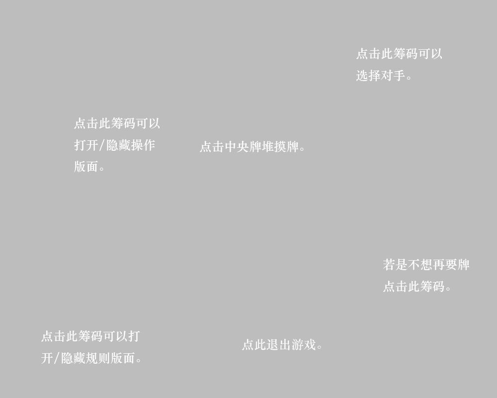

<!DOCTYPE html>
<html>
	<head>
		<meta charset="UTF-8">
        <link rel="icon" type="image/x-icon" href="./favicon.ico" />
		<title>十点半</title>
        <link type="text/css" rel="stylesheet" href="css.css"/>
		
		
        
        
	</head>
	
	<body>
        

            

                <h1>LOADING......</h1>
                

                <h2>点击开始</h2>
            

            

            
            

                

                

                

                

                

                

            

            
            

                

                

                

                

                

                

            

            
            

            

            
            

                

                    <h3>请选择您的对手:</h3>
                    一根筋
                    老油条
                    出千者
                    
                    
                    
                    
                    
                

            

            

            

                

                    <h3>规则说明:</h3>
                    
①点数计算：从A(1)~10的牌点数均为其自身数字。A为1点。

                    
其中J、Q、K和大小王均为半点。玩家点数为手中所有牌点数相加。

                    
②游戏流程：双方轮流选择要牌。玩家可选择要牌或者不要牌。要牌从牌堆中摸一张牌。不要牌则玩家不可再选择要牌，只能等对方执行直到游戏结束。

                    
③结果判断：玩家要以尽量使点数和不大于十点半为前提，使自己点数较大。

                    
若游戏一方摸牌之后手中牌点数超过十点半则立即判负。另一方点数不大于十点半的判赢。若是摸牌后点数刚好等于十点半，则立即判赢

                    
每人手中牌上限为五张。点数不大于十点半并且手中牌达到五张则不能再进行摸牌。双方均达到五张则进行判断，点数接近十点半的判赢。

                    
若游戏一方手牌不足五张并且放弃要牌，另一方要足五张且始终点数小于十点半，则不进行点数比较，五张牌的玩家获胜。

                    
点击筹码隐藏

                

            

            

            <input type="button" id="opponentB"/>
            <input type="button" id="endB"/>
            <input type="button" id="ruleB"/>
            <input type="button" id="wayToPlayB"/>
            <input type="button" id="endW"/>
            
<h1></h1>

            
        

        
	</body>

</html>
